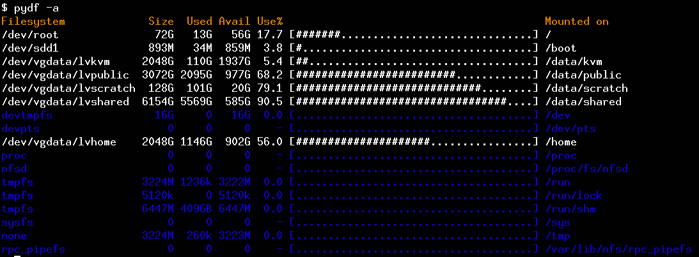

# PyPI package for pydf 

**NOTE**: *This repo is used for generating a [PyPI package](https://pypi.python.org/pypi/pydf) for [pydf tool](http://kassiopeia.juls.savba.sk/~garabik/software/pydf/) written by [Radovan Garabík](http://kassiopeia.juls.savba.sk/~garabik/). This makes it possible to install pydf with the familiar `pip` command. I have not written 'pydf'; I just hope to maintain the package and possibly fix some bugs. Improvements to `setup.py` and related files are welcome in the form of PRs. --k4rtik*

Original README with some additional formatting and screenshots follow.

---

## pydf

pydf is all-singing, all-dancing, fully colourised `df(1)`-clone
written in python.

### Requirements:
pydf was written for linux, using specific linux features.
The fact it runs on other systems is pure coincidence,
but neverthless it happens to work on wide range of modern
unix systems.

System-wide configuration is in `/etc/pydfrc`, per-user 
configuration in `~/.pydfrc` (format of these files is the same)

### Colours are one of: 
> none, default, bold, underline, blink, reverse, concealed, 
  black, green, yellow, blue, magenta, cyan, white,
  on_black, on_green, on_yellow, on_blue, on_magenta, on_cyan, on_white
  beep

on_red means that the background (instead of foreground) is painted 
with red etc...


### pydf recognizes following parameters:
```
  --help                show this help message
  -a, --all             include filesystems having 0 blocks
  -h, --human-readable  print sizes in human readable format (e.g., 1K 234M 2G)
  -H, --si              likewise, but use powers of 1000 not 1024
  -bBLOCKSIZE, --block-size=BLOCKSIZE
                        use SIZE-byte blocks
  -l, --local           limit listing to local filesystems
  -k, --kilobytes       like --block-size=1024
  -m, --megabytes       like --block-size=1048576
  -g, --gigabytes       like --block-size=1073741824
  --blocks              use filesystem native block size
  --bw                  do not use colours
  --mounts=MOUNTS_FILE  File to get mount information from. On normal linux
                        system, only /etc/mtab or proc/mounts make sense. Some
                        other unices use /etc/mnttab. Use /proc/mounts when
                        /etc/mtab is corrupted or inaccesable  (the output
                        looks a bit weird in this case).
  -B, --show-binds      show also mount --bind mounted filesystems
```

Written by [Radovan Garabík](mailto:garabik@kassiopeia.juls.savba.sk).  
For new versions, look at http://kassiopeia.juls.savba.sk/~garabik/software/pydf/

---

### Screenshots


